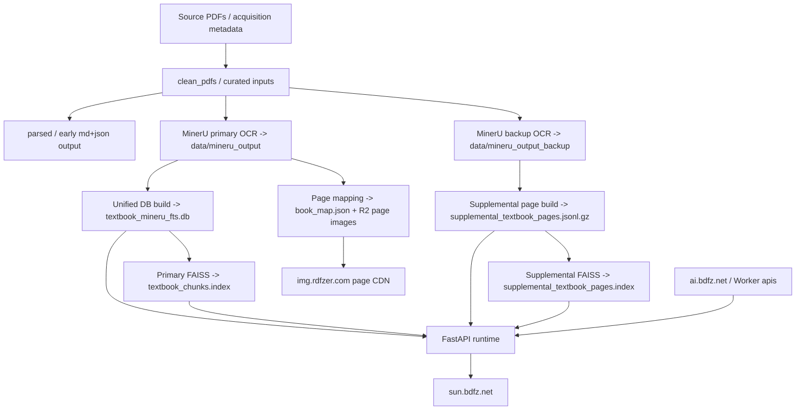

# Data Layer Lineage Memory

This document is the durable operating memory for the textbook project. Before any data rebuild, deploy, rollback, or search-quality debugging, read this file first.

It records:

- what data exists
- what each count actually means
- how source PDFs become OCR, DB, vectors, page images, and runtime assets
- how Docker and VPS consume those assets
- which external services are part of the real runtime path
- which update steps are mandatory and must not be skipped

This file is intended to be the first stop before future updates so the project does not lose critical context between iterations.

## Read-first rules

Before changing anything, answer these questions from this document:

1. Am I looking at local pending state or production current state?
2. Is the problem in primary DB, primary FAISS, supplemental page index, supplemental FAISS, page images, frontend rendering, or AI gateway?
3. Which count am I quoting:
   - source PDFs
   - cleaned PDFs
   - primary searchable books
   - page-image books
   - supplemental manifest books
   - visible `/api/books` books
   - DB chunks
   - primary vectors
   - supplemental pages
   - supplemental vectors
4. Did a mapping rule change happen without rebuilding supplemental vectors?
5. Did production receive only the DB while FAISS / supplemental assets stayed old?
6. Are frontend version markers, backend behavior, and GitHub docs aligned for the same release?
7. Is the result showing the right book identity, edition, and page-image source?
8. If a query is wrong, is it a data identity problem, a retrieval problem, or a UI labeling problem?
9. Has `textbook_version_manifest.json` been regenerated, and are `unresolved_primary_books=0`, `duplicate_primary_identity_groups=0`, and `safe_merge_candidates=0`?

## Canonical states

Two states must always be tracked separately:

- Production current: what [sun.bdfz.net](https://sun.bdfz.net) is actually serving
- Local pending rollout: what has been rebuilt locally but not yet deployed

As of 2026-03-10:

| Layer | Production current | Local pending rollout | Notes |
| --- | --- | --- | --- |
| Main DB | `textbook_mineru_fts.db`, `21925` rows | same DB file currently in local `data/index/` | Runtime startup auto-syncs only this DB |
| Main dense vectors | `17896` vectors, loaded | same local primary FAISS | Physical DB filter is `source != 'gaokao'`, not `source='textbook'` |
| Supplemental page index | corrected build loaded: `books=176`, `primary_books=52`, `supplemental_only_books=124`, `pages=22844` | rebuilt product-scoped source: `books=175`, `primary_books=57`, `supplemental_only_books=118`, `pages=2843`, `source_pages=31170`, `unsupported_pages_omitted=17603` | Local pending rollout now keeps only the public support scope (`人教版全部` + `英语·北师大版` + `化学·鲁科版`) in the runtime supplemental corpus |
| Supplemental vectors | loaded on production: `22844` vectors, manifest present, health `loaded=true` | local rebuild verified: `2843` vectors against the scoped `2843`-page source | These assets still must be explicitly transported; GitHub deploy does not pull them automatically from local `data/index/` |
| Frontend version marker | `2026.03.10-r23` | local code is prepared for `2026.03.10-r27` | Frontend marker must move with the support-scope rollout so book labels and runtime behavior stay in sync |

Never mix production current counts with local rebuilt counts in release notes or debugging conclusions.

## Project topology

### Main runtime project

- GitHub/repo runtime project: `platform/`
- Production container app:
  - FastAPI backend under `platform/backend/`
  - static frontend under `platform/frontend/`
- Deploy workflow:
  - GitHub Actions clones a fresh checkout on the VPS
  - `platform/scripts/deploy_vps.sh` builds the image and cuts over

Important repository boundary:

- `platform/` is the GitHub-tracked deploy repo
- the workspace root `/Users/ylsuen/textbook_ai_migration/scripts` contains local data-processing tooling, but that tree is not part of the `platform/` Git repository
- changes under the workspace-root `scripts/` tree do not reach production through `git push`; they affect local rebuild capability only unless separately copied or mirrored into a tracked repo
- as of 2026-03-10, the local workspace-root scripts `scripts/pdf_to_pages.py` and `scripts/33_rebuild_mineru_chunks_from_content_list.py` were updated to understand `textbook_version_manifest.json` schema v2 (`by_content_id + by_book_key`); future local page-image or chunk rebuilds should preserve that compatibility

### External runtime dependencies

- Production site: [sun.bdfz.net](https://sun.bdfz.net)
- Image CDN: [img.rdfzer.com](https://img.rdfzer.com)
- AI gateway canonical domain: [ai.bdfz.net](https://ai.bdfz.net)
- AI gateway implementation currently routes to Cloudflare Worker service `apis` / `production`
- Worker code lives outside this repo at:
  - `/Users/ylsuen/CF/upgrade_staging/apis/apis.js`

### Runtime host role

- Production VPS hosts Docker runtime only
- Production VPS is not the place to run OCR, MinerU, or FAISS rebuild jobs
- Large rebuilds belong on a local or offline processing machine

## Environment matrix

### Local machine roles

- code editing, data inspection, manifest checks, and lightweight validation
- primary Python preference for general project operations: `/Users/ylsuen/.venv`
- current supplemental vector rebuild path uses a dedicated local environment:
  - `/Users/ylsuen/textbook_ai_migration/.venv-vector`
  - reason: isolate heavy sentence-transformers build execution on macOS and avoid the earlier local crash path

### Local network environment

- The primary workstation runs `sing-box.app` with TUN mode enabled.
- Current confirmed route checks on 2026-03-10:
  - `route -n get github.com` -> `interface: utun8`
  - `route -n get 23.19.231.173` -> `interface: utun8`
- Practical consequence:
  - large uploads and deploy traffic from the workstation are expected to traverse the sing-box TUN path
  - when a transfer is unexpectedly slow, verify route first before assuming application-layer failure
  - do not hardcode one artifact path forever; benchmark the available paths for the current session before choosing
  - candidate paths for large runtime artifacts:
    - direct workstation -> VPS over SSH / `scp` / `rsync`
    - workstation -> R2, then VPS -> `curl`
  - current measured outcome on 2026-03-10:
    - direct SSH upload to VPS over `utun8` was slower and less stable
    - `R2 -> VPS curl` was the more reliable choice for this rollout
- Route and process retrieval points:
  - `ps -axo pid,etime,command | rg 'sing-box|singbox|tun'`
  - `ifconfig | rg -n 'utun|tun'`
  - `route -n get github.com`
  - `route -n get 23.19.231.173`

### Production runtime environment

- base image: `python:3.13-slim`
- single-container FastAPI runtime
- host-mounted:
  - `/data`
  - `/state`
- shared HF cache root inside container environment:
  - `/state/cache/huggingface/hub`

### Environment rule

Do not assume that a local artifact exists on the VPS just because local code can see it. Local `data/index/` and production `/data/index/` are different asset stores.
Also do not assume that an upload problem is a code problem before confirming whether the transfer path is using the expected sing-box TUN route.

## Identity model

The project has multiple identity layers. Mixing them causes bad mappings and search corruption.

### Source identity

- `subject`
- normalized `title`
- `edition`
- `content_id` when available
- file path lineage

`content_id` is the strongest identity signal and should win whenever present.

### Runtime book identity

- `book_key`
  - primary books use stable SmartEdu-derived book keys
  - supplemental-only books use synthetic `suppbook:*`
- `display_title`
  - user-facing title with edition or disambiguating suffix
- `short_key`
  - only for books that have page-image mapping in `book_map.json`

### Page identity

- physical page index: zero-based page used by R2 page images
- logical page number: printed page number in the book, when known
- `page_num` in runtime/page-image code should be treated as physical page index unless a separate logical-page field is explicitly present

### Chunk identity

- DB `chunks.id`: physical row identity
- DB `source`: current physical values are `mineru` and `gaokao`
- Runtime “textbook” is a logical concept built on `source != 'gaokao'`
- Analytics helper tables may use logical labels instead of physical DB labels
  - for example, `keyword_counts.source` currently uses `textbook` / `gaokao`

Important: when debugging DB counts, do not filter local rows by `source='textbook'`. The current DB stores textbook rows as `source='mineru'`.

## Canonical directories and current local counts

All counts below are current local filesystem counts and are not interchangeable.

### Source and preprocessing trees

| Directory | Meaning | Current count / size |
| --- | --- | --- |
| `data/raw_pdf` | source PDFs downloaded from textbook acquisition flows | `53` recursive PDFs, about `5.0G` |
| `data/clean_pdfs` | curated / normalized PDFs used for later processing | `63` PDFs, about `6.4G` |
| `data/parsed` | earlier Markdown and JSON parsing output | `315` Markdown + `315` JSON, about `42G` |
| `data/mineru_output` | primary OCR corpus for main searchable books | `69` Markdown + `207` JSON + embedded PDFs, about `23G` |
| `data/mineru_output_backup` | backup OCR corpus for supplemental page-level recall | `253` Markdown + `759` JSON + embedded PDFs, about `80G` |

Notes:

- Recursive PDF counts inside `mineru_output` and `mineru_output_backup` are not book counts. These trees include embedded PDFs and processing artifacts. Use Markdown-file count or manifest counts as the book proxy there.
- The public textbook download library count mentioned elsewhere, such as “316 textbooks”, is not the same thing as the current local actively processed runtime corpus. Treat that as a separate public-library metric and re-verify independently before using it publicly.

### Runtime-oriented local artifacts

| Artifact | Meaning | Current local status |
| --- | --- | --- |
| `data/index/textbook_mineru_fts.db` | main runtime DB | about `56M` |
| `data/index/textbook_chunks.index` | primary FAISS | about `70M`, `17896` vectors |
| `data/index/textbook_chunks.manifest.json` | primary FAISS manifest | present |
| `platform/backend/supplemental_textbook_pages.jsonl.gz` | supplemental page index source bundled in repo | about `1.8M`, `2843` searchable rows (`31170` merged source pages before omission/dedupe) |
| `platform/backend/supplemental_textbook_pages.manifest.json` | supplemental page manifest bundled in repo | about `110K` |
| `data/index/supplemental_textbook_pages.index` | supplemental FAISS target path | about `11M`, verified against the scoped `2843`-page source |
| `data/index/supplemental_textbook_pages.vector.manifest.json` | supplemental FAISS manifest | present, verify required before release |

Other data directories that matter operationally:

- `data/dict_pages`
  - dictionary page images staged for R2
- `data/gaokao_raw`
- `data/gaokao_scraped`
- `data/gaokao_exam_images`
- `data/_img_tmp`
  - temporary page-image working tree

## Canonical runtime asset ledger

Use this ledger before every upload, sync, or rollback. Do not transfer a runtime asset until its path, size, and SHA256 have been matched against this table or intentionally refreshed.

### Local canonical release artifacts

| Relative path | Role | Size (bytes) | SHA256 |
| --- | --- | ---: | --- |
| `data/index/textbook_mineru_fts.db` | main runtime DB | `58892288` | `5a92fff4f33c4891a7b6916ce26eda69b413c8a3f852e1b8687c70e75fa45c71` |
| `data/index/textbook_chunks.index` | primary FAISS index | `73445274` | `2c5a5aa221c6e42ae0e3ca6e841c1a8dbe7b40fba606d5cf2345e59eccde0331` |
| `data/index/textbook_chunks.manifest.json` | primary FAISS manifest | `891` | `394d69870d116106fdcf7a5f17af9aa0275139340c41a8b029bb7a43f1664155` |
| `platform/backend/supplemental_textbook_pages.jsonl.gz` | bundled supplemental page source | `1889049` | `16937cbe0a7034ccc40b29e7db65fc12f3db5ecf0c0f29cfd431c07e9a75344e` |
| `platform/backend/supplemental_textbook_pages.manifest.json` | bundled supplemental page manifest | `111821` | `bd071850079a96976ad6b495c91143ae8fca0bd1f6dd70bc41d6066cb72f2a9c` |
| `data/index/supplemental_textbook_pages.index` | supplemental FAISS index | `11644973` | `879a02d544e999bfc31813eab76bbd5bf1b8b91a7ec70fb3f4cd65e2d2c5f4ca` |
| `data/index/supplemental_textbook_pages.vector.manifest.json` | supplemental FAISS manifest | `717` | `f2fbbbb91988d58f891d90ab8677c7a05732de3308bfde7a1222c53e8bc9425f` |
| `platform/frontend/assets/pages/book_map.json` | page-image identity map | `40261` | `b005aabe1a5f5ce3311fc849999de54db3ae3bf2b0afb10cc2921b7aeba7485d` |
| `platform/backend/textbook_version_manifest.json` | version-label manifest | `72847` | `674494d6de4c0acca0e4e9a2f3c265e80d8865bfd4167f6ea9a021e934c88c93` |
| `platform/frontend/assets/version.json` | public frontend version ledger | `6303` | `5369c2d567f9223647d5a34857d2098fbab25c3c0ce5a6007a235afb74c0bc74` |

Important DB note:

- `textbook_mineru_fts.db` is a mutable runtime file because local smoke tests and production traffic can append telemetry tables and log rows.
- File-level SHA256 for this DB is therefore not a stable content identity signal by itself.
- For release verification, pair the DB file SHA with a stable textbook-corpus fingerprint derived from `chunks WHERE source != 'gaokao'`.

### Production runtime destinations

These are the runtime destinations that must match the intended release artifact set:

- `/root/cross-subject-knowledge/data/index/textbook_mineru_fts.db`
- `/root/cross-subject-knowledge/data/index/textbook_chunks.index`
- `/root/cross-subject-knowledge/data/index/textbook_chunks.manifest.json`
- `/root/cross-subject-knowledge/data/index/supplemental_textbook_pages.jsonl.gz`
- `/root/cross-subject-knowledge/data/index/supplemental_textbook_pages.manifest.json`
- `/root/cross-subject-knowledge/data/index/supplemental_textbook_pages.index`
- `/root/cross-subject-knowledge/data/index/supplemental_textbook_pages.vector.manifest.json`

### Artifact verification rule

Before any transfer:

1. confirm the exact source path you are about to copy
2. compute its size and SHA256
3. compare that output to this ledger or to a deliberately updated replacement ledger
4. only then copy it to R2 or directly to the VPS
5. after the remote copy completes, recompute remote size and SHA256 before cutover

This rule exists because a Git checkout, a local build output, and a repo-bundled fallback file may have the same filename while representing different release states.

Current-vector verification note for this round:

- `platform/scripts/build_supplemental_vector_index.py verify` has passed against the current `platform/backend/supplemental_textbook_pages.jsonl.gz`
- verified result: `2843` vector rows, `1024` dimensions, fingerprint `5d2ecfc643d22aa32026b4f94dba14dd320d797c3f1408f7d6c9fb8768886948`

## Current corpus counts and relationships

### Main runtime corpus

Local main DB facts:

- DB total rows: `21925`
- textbook-runtime rows: `17896`
  - physical DB filter: `source != 'gaokao'`
- gaokao rows: `4029`
- distinct primary textbook `book_key`s in DB: `69`
- distinct gaokao `book_key`s: `416`
- books in `platform/frontend/assets/pages/book_map.json`: `69`
- `platform/backend/textbook_version_manifest.json` schema: `2`
- version manifest `by_book_key` entries: `69`
- version manifest `by_content_id` entries: `33`
- unresolved primary editions in version manifest: `0`
- duplicate primary identities in version manifest: `0`
- remaining safe merge candidates after rebuild: `0`

Main DB subject row counts for `source != 'gaokao'`:

- 数学: `5116`
- 英语: `3580`
- 化学: `1736`
- 物理: `1629`
- 思想政治: `1250`
- 语文: `1228`
- 地理: `1153`
- 生物学: `1151`
- 历史: `1053`

Do not confuse:

- distinct books in DB
- books with page-image maps
- books in the version manifest
- books with real `content_id` entries in the version manifest

Those are four different sets.

### Supplemental page corpus

Corrected local supplemental manifest facts:

- indexed source files: `251 / 251`
- manifest books: `175`
- searchable runtime pages: `2843`
- merged source pages before omission/dedupe: `31170`
- books safely merged back to primary `book_key`: `57`
- supplemental-only books in the identity manifest: `118`
- supported supplemental-only visible books in the current public release: `27`
- primary-bound duplicate pages omitted from runtime search: `10724`
- unsupported-version supplemental pages omitted from runtime search: `17603`
- duplicate OCR pages collapsed inside the release-scoped supplemental corpus: `0`
- unresolved books: `0`
- unresolved pages: `0`
- edition conflicts: `0`
- remaining same-identity cross-source conflicts: `0` (checked by audit, and future rebuilds should fail if this rises above `0`)

Supplemental page row facts:

- total searchable rows: `2843`
- searchable rows with `content_id`: `2843`
- searchable rows without `content_id`: `0`
- searchable rows bound to primary page images: `0`
- searchable rows carrying an explicit `book_map_key` field: `0`
- empty-text rows: `0`

Supplemental-only source PDF coverage facts:

- books with `*_origin.pdf`: `27 / 27`
- books with `*_layout.pdf`: `27 / 27`
- books with `*_span.pdf`: `27 / 27`
- all `27` supported supplemental-only books in the current public release have generated page-image products and valid `book_map.json` entries
- release rule: do not remap unsupported parallel editions to a supported primary book merely to surface a page image
- future expansion note: unsupported parallel editions remain preserved in the audit data layer and can be productized later as a separate page-image rollout

Supplemental page counts by subject:

- 英语: `869`
- 地理: `714`
- 物理: `767`
- 化学: `367`
- 生物学: `126`

Subjects intentionally absent from searchable supplemental rows after identity cleanup:

- 数学、语文、历史、思想政治 currently contribute `0` searchable supplemental rows in the current public release scope

Supplemental manifest book counts by subject:

- 英语: `42`
- 数学: `37`
- 地理: `31`
- 物理: `17`
- 化学: `15`
- 生物学: `15`
- 思想政治: `8`
- 历史: `5`
- 语文: `5`

Supplemental manifest edition distribution highlights:

- 人教版: `48`
- 沪教版: `19`
- 中图版: `10`
- 沪科版: `16`
- 苏教版: `14`
- 湘教版: `9`
- 北师大版: `8`
- 鄂教版: `7`
- B版: `7`
- 上外教版: `7`
- 重大版: `7`

Relationship rule that must stay explicit:

- supplemental manifest books: `175`
- supplemental books merged into primary: `57`
- supplemental-only books in the identity manifest: `118`
- supported supplemental-only books currently released: `27`
- visible `/api/books` total in the current public release: `35 + 27 = 62`

Never report `175` or `118` as the current public `/api/books` total.

## Count and terminology audit points

These are the recurring caliber problems that must be checked every round.

### Non-interchangeable counts

The following must never be conflated:

- source PDF count
- cleaned PDF count
- primary OCR Markdown count
- backup OCR Markdown count
- primary searchable books in the DB
- books with page-image mapping in `book_map.json`
- books covered by `textbook_version_manifest.json.by_book_key`
- books covered by `textbook_version_manifest.json.by_content_id`
- supplemental manifest books
- supplemental-only visible books
- visible `/api/books` total
- DB textbook-runtime rows
- primary FAISS vector rows
- supplemental page rows
- supplemental FAISS vector rows

### Primary corpus wording

When describing the main searchable textbook corpus:

- logical runtime wording: “textbook corpus” or “non-gaokao textbook rows”
- physical DB filter: `source != 'gaokao'`
- physical row label in `chunks`: `mineru`

Do not write “`source='textbook'` in the main DB” unless the DB schema actually changes to that.

### Analytics wording

For analytics helper tables, verify the table’s own semantics first.

- `keyword_counts.source` currently uses logical labels:
  - `textbook`
  - `gaokao`
- that does not match the physical `chunks.source` labels

### Book totals wording

When describing books:

- `69` = full primary books present in the runtime DB and page-image registry
- `35` = supported primary books in the current public release
- `175` = corrected supplemental manifest books after identity audit
- `118` = supplemental-only books in the full identity manifest after removing the `57` books merged back into primary identities
- `27` = supported supplemental-only books in the current public release
- `62` = expected visible `/api/books` total in the current public release

### Production-vs-local wording

Before writing any status update, release note, or GitHub summary:

- explicitly say whether the number is:
  - production current
  - local pending rollout

Never silently switch between the two.

## Data lineage: source to runtime



### Stage 1: acquisition

Primary scripts:

- `scripts/01_download_textbooks.sh`
- `scripts/01_download_textbooks_via_images.py`

Outputs:

- `data/raw_pdf`

### Stage 2: early parsing and OCR intermediates

Primary scripts:

- `scripts/02_pdf_to_md.py`
- `scripts/06_ocr_pages_to_jsonl.py`
- `scripts/07_ocr_fullpage.py`
- `scripts/08_mineru_batch.py`

Outputs:

- `data/parsed`
- `data/mineru_output`
- `data/mineru_output_backup`
- `data/index/mineru_chunks.jsonl` and related intermediate JSONL files

### Stage 3: main search DB and concept data

Primary scripts:

- `scripts/09_build_unified_index.py`
- `scripts/19_build_concept_map.py`

Outputs:

- `data/index/textbook_mineru_fts.db`

### Stage 4: primary dense vectors

Primary script:

- `scripts/21_build_vector_index.py`

Outputs:

- `data/index/textbook_chunks.index`
- `data/index/textbook_chunks.manifest.json`

### Stage 5: page mapping and page-image delivery

Primary scripts:

- `scripts/31_generate_page_maps.py`
- `scripts/32_apply_page_mapping.py`
- `scripts/upload_pages_r2.py`

Outputs:

- `platform/frontend/assets/pages/book_map.json`
- `platform/frontend/assets/pages/{short_key}/p{N}.webp`
- R2 `pages/{short_key}/p{N}.webp`

Current operational boundary:

- the current page-image product covers the `69` primary books in `book_map.json`
- it does not yet cover the `118` supplemental-only visible books, even though those books already have `origin/layout/span` PDFs in `data/mineru_output_backup`
- therefore, missing `查看原文` on a supplemental-only result should currently be interpreted as “page-image product not generated for this edition yet”, not “the OCR text was mapped to the wrong primary book”

### Stage 6: supplemental page index

Primary script:

- `platform/scripts/build_supplemental_textbook_index.py`

Inputs:

- `data/mineru_output_backup`
- `data/index/textbook_mineru_fts.db`
- `platform/frontend/assets/pages/book_map.json`

Outputs:

- `platform/backend/supplemental_textbook_pages.jsonl.gz`
- `platform/backend/supplemental_textbook_pages.manifest.json`

Current safe mapping rules:

- prefer direct `content_id` match
- require edition consistency if `edition_hint` exists
- if no edition hint exists, allow title-based match only when `(subject, normalized title)` resolves uniquely
- otherwise generate independent `suppbook:*`

These rules exist to prevent cross-edition corruption while still allowing safe rebinding to primary page-image books.

### Stage 7: supplemental dense vectors

Primary script:

- `platform/scripts/build_supplemental_vector_index.py`

Outputs:

- `data/index/supplemental_textbook_pages.index`
- `data/index/supplemental_textbook_pages.vector.manifest.json`

Runtime rule:

- if the supplemental page source fingerprint or source `sha256` no longer matches the vector manifest, the supplemental FAISS must be treated as stale and disabled until rebuilt

## Docker and runtime data contract

### What is inside the image

[`platform/Dockerfile`](../Dockerfile) copies only:

- `backend/`
- `frontend/`
- runtime Python dependencies

The image does not bake the heavy runtime data tree under `data/`.

Repo-bundled fallback assets currently inside `platform/backend/`:

- `supplemental_textbook_pages.jsonl.gz`
- `supplemental_textbook_pages.manifest.json`
- optionally supplemental vector files if explicitly copied there for a release

### What is runtime-mounted

Required host-mounted roots:

- `/data`
- `/state`

Required runtime assets:

- `/data/index/textbook_mineru_fts.db`
- `/data/index/textbook_chunks.index`
- `/data/index/textbook_chunks.manifest.json`
- `/data/index/supplemental_textbook_pages.jsonl.gz`
- `/data/index/supplemental_textbook_pages.manifest.json`

Conditionally required runtime assets:

- `/data/index/supplemental_textbook_pages.index`
- `/data/index/supplemental_textbook_pages.vector.manifest.json`

Startup behavior from [`platform/backend/entrypoint.sh`](../backend/entrypoint.sh):

1. run `sync_db.py`
2. run `preflight.py`
3. start `uvicorn`

The runtime does not rebuild FAISS or supplemental assets on the VPS.

### DB drift rule

[`platform/backend/sync_db.py`](../backend/sync_db.py) auto-syncs only:

- `textbook_mineru_fts.db`

It does not auto-sync:

- `textbook_chunks.index`
- `textbook_chunks.manifest.json`
- `supplemental_textbook_pages.jsonl.gz`
- `supplemental_textbook_pages.manifest.json`
- `supplemental_textbook_pages.index`
- `supplemental_textbook_pages.vector.manifest.json`

Therefore the DB can move ahead while FAISS and supplemental assets stay old. This is one of the main failure modes of the current release model.

## Cloudflare and image-storage contract

### R2 / CDN naming

Page-image naming is part of the data contract.

Textbook page images:

- local source: `platform/frontend/assets/pages/{short_key}/p{N}.webp`
- remote R2/CDN path: `pages/{short_key}/p{N}.webp`
- CDN base: `https://img.rdfzer.com/pages/{short_key}/p{N}.webp`

Dictionary page images:

- remote protected dirs include:
  - `pages/dict_xuci/`
  - `pages/dict_changyong/`
  - `pages/dict_ciyuan/`

Inline book-origin images shown in results:

- `https://img.rdfzer.com/orig/{urlencoded_book_key}/{filename}`

Gaokao images:

- `https://img.rdfzer.com/gaokao/{filename}`

### R2 sync rule

[`scripts/upload_pages_r2.py`](../../scripts/upload_pages_r2.py) stages textbook and dictionary page trees together before `rclone sync`.

Do not sync only textbook page roots to the `pages/` prefix. That would delete remote dictionary assets.

## AI integration contract

Backend defaults in `platform/backend/main.py` currently point to:

- AI service URL default: `https://apis.bdfz.workers.dev/`
- AI label default: `Gemini`
- AI model default: `gemini-flash-latest`

External worker implementation currently has its own defaults in:

- `/Users/ylsuen/CF/upgrade_staging/apis/apis.js`

Current worker defaults include:

- generic text/chat default model: `gemini-3.1-flash-lite-preview`
- vision fallback model: `gemini-flash-latest`

This means model naming and default behavior must be checked on both sides when debugging AI output drift. Do not assume backend-requested model and worker-internal fallback are the same thing.

## Parameter surfaces and retrieval points

These are the main parameter/control surfaces that must be checked before release. If a parameter changes, its retrieval point must be verified in the corresponding file or endpoint.

### Runtime roots and filesystem parameters

Retrieval points:

- `platform/Dockerfile`
  - `PROJECT_ROOT`
  - `DATA_ROOT`
  - `STATE_ROOT`
  - `PORT`
  - `HF_HOME`
  - `SENTENCE_TRANSFORMERS_HOME`
  - `TRANSFORMERS_CACHE`
- `platform/backend/main.py`
  - local/runtime path resolution
  - bundled vs runtime supplemental asset discovery
- `platform/backend/preflight.py`
  - required runtime assets
- `platform/backend/sync_db.py`
  - DB auto-sync source and target paths
- `platform/scripts/deploy_vps.sh`
  - runtime mount destinations and rollout gate behavior

### Search and retrieval parameters

Retrieval points in `platform/backend/main.py`:

- `SQLITE_BUSY_TIMEOUT_MS`
- `FAISS_SCORE_THRESHOLD`
- `SUPPLEMENTAL_VECTOR_ENABLED`
- `SUPPLEMENTAL_VECTOR_SCORE_THRESHOLD`
- `QUERY_TERM_PLAN_LIMIT`
- `SUPPLEMENTAL_FALLBACK_LIMIT`
- `RERANKER_ENABLED`
- `RERANKER_PRELOAD`
- `RERANKER_MAX_CANDIDATES`
- `RERANKER_FINAL_LIMIT`
- `GRAPH_RAG_ENABLED`
- `GRAPH_RAG_MAX_RELATIONS`
- evidence-span cache and semantic cache parameters

### AI gateway parameters

Retrieval points:

- `platform/backend/main.py`
  - `AI_SERVICE_URL`
  - `AI_SERVICE_LABEL`
  - `AI_SERVICE_MODEL`
  - `AI_SERVICE_TIMEOUT_SEC`
  - `AI_SERVICE_RETRIES`
  - `AI_SERVICE_RETRY_DELAY_SEC`
  - `AI_SERVICE_ORIGIN`
  - `AI_SERVICE_REFERER`
  - `AI_SERVICE_USER_AGENT`
  - `AI_SERVICE_PROJECT`
  - `AI_SERVICE_TASK_TYPE`
  - `AI_SERVICE_THINKING_LEVEL`
  - `AI_INTERNAL_TOKEN`
- external worker implementation:
  - `CF/upgrade_staging/apis/apis.js`
  - check worker default model and fallback model there

### Supplemental data gates

Retrieval points:

- `platform/backend/main.py`
  - `SUPPLEMENTAL_REQUIRED`
  - supplemental source fallback order
  - supplemental vector source fallback order
- `platform/backend/preflight.py`
  - `SUPPLEMENTAL_REQUIRED`
  - `SUPPLEMENTAL_VECTOR_REQUIRED`
- `platform/scripts/deploy_vps.sh`
  - `SUPPLEMENTAL_VECTOR_BUNDLED`
  - `HEALTH_REQUIRE_RERANKER`
  - `HEALTH_REQUIRE_SUPPLEMENTAL_VECTOR`

### Frontend version and asset markers

Retrieval points:

- `platform/frontend/assets/version.json`
  - public version history and current version marker
- `platform/frontend/index.html`
  - cache-buster query strings for `style.css` and `app.js`
- `platform/frontend/assets/app.js`
  - `IMG_CDN`
  - API request behavior and UI rendering assumptions

### Image/CDN contract

Retrieval points:

- `platform/backend/main.py`
  - `IMG_CDN`
  - `/api/page-image`
- `platform/frontend/assets/app.js`
  - textbook inline image path
  - gaokao image path
- `scripts/upload_pages_r2.py`
  - textbook page upload roots
  - dictionary protected roots
  - final R2 path contract

### Health and live runtime retrieval points

Retrieval points:

- live endpoint: `/api/health`
- live endpoint: `/assets/version.json`
- live endpoint: `/api/books`
- live endpoint: `/api/search`
- live endpoint: `/api/page-image`

Important `/api/health` fields to check:

- `status`
- `db.chunks`
- `faiss.ok`
- `faiss.vectors`
- `faiss.manifest.vector_rows`
- `model.ok`
- `reranker.loaded`
- `supplemental.ok`
- `supplemental.source`
- `supplemental.manifest.source_files_total`
- `supplemental.manifest.source_files_indexed`
- `supplemental.manifest.books`
- `supplemental.manifest.primary_books`
- `supplemental.manifest.supplemental_only_books`
- `supplemental.manifest.pages`
- `supplemental.manifest.unresolved_books`
- `supplemental.manifest.unresolved_pages`
- `supplemental.manifest.edition_conflicts`
- `supplemental_vectors.enabled`
- `supplemental_vectors.loaded`
- `supplemental_vectors.vectors`
- `supplemental_vectors.reason`

## Production runtime facts

Current production VPS facts already confirmed:

- root filesystem: `99G` total, about `42G` available
- `/root/cross-subject-knowledge/data/index`: about `244M`
- `/root/cross-subject-knowledge/state/cache/huggingface/hub`: about `5.4G`
- `/var/lib/docker`: about `2.7G`
- memory: `5.8Gi`, available about `3.3Gi`
- swap: `0`

Implications:

- production has enough disk for the pending supplemental assets
- production should still not be used for OCR or FAISS rebuilds
- lack of swap means Docker build spikes or large model warmup should stay conservative

## Release and deploy contract

### Current deploy path

[`platform/.github/workflows/deploy.yml`](../.github/workflows/deploy.yml) does this:

1. SSH into the VPS
2. create a fresh temporary release checkout
3. `git clone --depth 1 --branch main ...`
4. run `platform/scripts/deploy_vps.sh`

This means:

- the VPS deploy does not see arbitrary local files unless they are committed to the repo or copied to the runtime host by a separate step
- a locally built supplemental vector under local `data/index/` will not magically appear on the VPS
- docs-only pushes are now expected to be filtered by workflow `paths-ignore`; release pushes that should touch production must include runtime-affecting files

### Mandatory asset groups

If the main DB changes, verify at least:

- `textbook_mineru_fts.db`
- `textbook_chunks.index`
- `textbook_chunks.manifest.json`

If supplemental mapping or supplemental page source changes, rebuild and ship all of:

- `supplemental_textbook_pages.jsonl.gz`
- `supplemental_textbook_pages.manifest.json`
- `supplemental_textbook_pages.index`
- `supplemental_textbook_pages.vector.manifest.json`

If frontend presentation of new data behavior changes, update together:

- `frontend/index.html` cache-buster
- `frontend/assets/version.json`
- frontend code
- backend behavior
- GitHub docs

### Health gate rule

Do not treat `/api/health status=ok` alone as release success.

For releases expecting semantic supplemental recall, release validation must also confirm:

- supplemental manifest loaded
- supplemental vectors loaded
- reranker loaded when rerank is required

## Mandatory pre-update review checklist

Before every rebuild, refactor, deploy, or rollback, check all of the following.

### A. Working tree and release scope

1. `git status --short`
2. `git rev-parse --short HEAD`
3. identify whether the change touches:
   - DB
   - primary FAISS
   - supplemental page index
   - supplemental FAISS
   - page-image mapping
   - frontend version markers
   - deploy scripts
   - AI gateway defaults
4. identify whether the release is code-only, data-only, or mixed

### B. Current local data state

Check or regenerate:

1. `platform/backend/supplemental_textbook_pages.manifest.json`
2. `data/index/textbook_chunks.manifest.json`
3. DB row counts from `data/index/textbook_mineru_fts.db`
4. `platform/frontend/assets/pages/book_map.json`
5. `platform/backend/textbook_version_manifest.json`
6. local supplemental vector manifest if the vector exists

Local caliber points to confirm explicitly:

- primary DB books
- primary vector rows
- supplemental manifest books
- supplemental merged-primary books
- supplemental-only visible books
- visible `/api/books` target total
- unresolved books/pages
- edition conflicts
- content-id-missing supplemental books
- blank-title duplicate groups
- if page-image scope changed in the release, whether new supplemental-edition page images were actually regenerated locally rather than only relabeled in metadata

### C. Current production state

Check live:

1. `/api/health`
2. `/assets/version.json`
3. `/api/books`
4. search regression queries on live production
5. if any large artifact was shipped separately, confirm the remote size and SHA256 against the intended release source before restart

At minimum, compare production current against local pending for:

- DB row count
- primary vector count
- supplemental manifest counts
- supplemental vector loaded state
- frontend version marker
- page-image scope:
  - `book_map.json` book count
  - whether any supplemental-only editions are intended to gain page images in this release
  - whether that change is reflected both in local page assets and in R2/CDN

### D. Deploy-path feasibility

Before release, confirm whether the changed artifacts will actually reach the VPS.

Check:

1. `.github/workflows/deploy.yml`
2. `platform/scripts/deploy_vps.sh`
3. benchmark the current-session transfer options for artifacts larger than about `50M`
   - direct workstation -> VPS over SSH / `scp` / `rsync`
   - workstation -> R2, then VPS -> `curl`
   - choose based on the current network route and measured throughput; do not hardcode `R2` forever
4. source and destination paths for:
   - supplemental page index
   - supplemental page manifest
   - supplemental vector index
   - supplemental vector manifest
5. whether the changed asset is:
   - committed into the repo checkout
   - copied separately to the VPS runtime root
   - or not transported at all

### E. VPS capacity and runtime constraints

Before shipping large artifacts, re-check:

- free disk
- available memory
- swap presence
- `data/index` size
- HF cache size
- Docker storage pressure

### F. Public-doc and version sync

Before release, confirm whether these need updating together:

- `platform/frontend/assets/version.json`
- `platform/frontend/index.html`
- `platform/README.md`
- `platform/docs/runtime_operations_overview.md`
- `platform/docs/data_layer_lineage_memory.md`

### G. AI and external-service alignment

Before release, confirm:

- backend AI defaults
- worker AI defaults
- current canonical public AI domain
- image CDN path contract
- R2 upload path contract

## Mandatory post-update verification checklist

After any update, run all relevant checks below.

### A. Local build and syntax checks

Run the project-relevant checks, including at least:

- `python3 -m py_compile` for changed Python modules
- `node --check platform/frontend/assets/app.js` if frontend JS changed
- `bash -n platform/scripts/deploy_vps.sh` if deploy script changed
- `git diff --check`

### B. Artifact integrity checks

If data changed, verify:

1. supplemental manifest values are the intended ones
2. supplemental vectors were rebuilt if the supplemental page source changed
3. supplemental vector `verify` passes against the current source
4. DB / primary FAISS manifest alignment still holds
5. book/page/image identity still matches the intended mapping rules

### C. Live deployment checks

After release, check live:

1. `/api/health`
2. `/assets/version.json`
3. `/api/books`
4. representative `/api/page-image` result
5. representative AI chat path if AI behavior changed
6. `supplemental_vectors.loaded=true` if the release expects supplemental semantic recall

### D. Search regression checks

After release, re-run at minimum:

- `潜热`
- `海面蒸发潜热`
- `极性`
- `极性键`
- `晶体的定义`

For each query, verify:

- no server error
- relevant top results
- correct subject behavior
- correct edition/book identity
- correct “view original” target
- no meaningless character-split fallback results

### E. Documentation and release-state checks

After release, confirm:

- frontend version marker matches the release
- cache-buster matches the release
- docs reflect the right production-vs-local wording
- GitHub-visible notes do not describe local-only assets as live
- if the release was mixed code+data, both sides are reflected in the public docs

## Suggested command entry points

These commands are the minimal retrieval entry points to pair with the checklists above. Run them from the repo root unless noted otherwise.

### Local state

```bash
git status --short
git rev-parse --short HEAD
```

```bash
python3 -m py_compile platform/backend/main.py \
  platform/backend/preflight.py \
  platform/scripts/build_supplemental_textbook_index.py \
  platform/scripts/build_supplemental_vector_index.py
node --check platform/frontend/assets/app.js
bash -n platform/scripts/deploy_vps.sh
git diff --check
```

### Local data/manifests

```bash
python3 - <<'PY'
import json, sqlite3
from pathlib import Path
root = Path('.').resolve()
man = json.loads((root / 'platform/backend/supplemental_textbook_pages.manifest.json').read_text())
print('supp_books', man.get('books'))
print('supp_pages', man.get('pages'))
print('supp_source_pages', man.get('source_pages'))
print('primary_books', man.get('primary_books'))
print('supp_only_books', man.get('supplemental_only_books'))
print('primary_bound_pages_omitted', man.get('primary_bound_pages_omitted'))
print('primary_bound_page_lookup_misses', man.get('primary_bound_page_lookup_misses'))
print('unresolved_books', man.get('unresolved_books'))
print('unresolved_pages', man.get('unresolved_pages'))
print('edition_conflicts', man.get('edition_conflicts'))
print('cross_source_identity_conflicts', man.get('cross_source_identity_conflicts'))
print('content_id_missing_books', man.get('content_id_missing_books'))
print('blank_title_duplicate_groups', man.get('blank_title_duplicate_groups'))
ver = json.loads((root / 'platform/backend/textbook_version_manifest.json').read_text())
print('primary_manifest_books', ver.get('primary_books'))
print('resolved_primary_books', ver.get('resolved_primary_books'))
print('unresolved_primary_books', ver.get('unresolved_primary_books'))
print('duplicate_primary_identity_groups', ver.get('duplicate_primary_identity_groups'))
print('safe_merge_candidates', len(ver.get('safe_merge_candidates') or []))
con = sqlite3.connect(root / 'data/index/textbook_mineru_fts.db')
cur = con.cursor()
print('db_total', cur.execute("SELECT COUNT(*) FROM chunks").fetchone()[0])
print('db_textbook_runtime', cur.execute("SELECT COUNT(*) FROM chunks WHERE source != 'gaokao'").fetchone()[0])
print('db_gaokao', cur.execute("SELECT COUNT(*) FROM chunks WHERE source = 'gaokao'").fetchone()[0])
print('db_books', cur.execute("SELECT COUNT(DISTINCT book_key) FROM chunks WHERE source != 'gaokao' AND book_key IS NOT NULL AND book_key<>''").fetchone()[0])
PY
```

```bash
/Users/ylsuen/.venv/bin/python platform/scripts/verify_textbook_runtime_data.py
```

### Supplemental vector verify

```bash
HF_HUB_OFFLINE=1 /Users/ylsuen/textbook_ai_migration/.venv-vector/bin/python \
  platform/scripts/build_supplemental_vector_index.py verify \
  --source platform/backend/supplemental_textbook_pages.jsonl.gz \
  --index data/index/supplemental_textbook_pages.index \
  --manifest data/index/supplemental_textbook_pages.vector.manifest.json
```

### Live production

```bash
curl -sS https://sun.bdfz.net/api/health | jq
curl -sS https://sun.bdfz.net/assets/version.json | jq
curl -sS https://sun.bdfz.net/api/books | jq '.books | length'
```

```bash
curl -sS 'https://sun.bdfz.net/api/search?q=潜热&source=textbook&limit=10' | jq
curl -sS 'https://sun.bdfz.net/api/search?q=极性&source=textbook&limit=10' | jq
curl -sS 'https://sun.bdfz.net/api/search?q=极性键&source=textbook&limit=10' | jq
curl -sS 'https://sun.bdfz.net/api/search?q=晶体的定义&source=textbook&limit=10' | jq
```

### VPS capacity and runtime assets

Use the production host shell to check:

```bash
df -h /
free -h
du -sh /root/cross-subject-knowledge/data/index
du -sh /root/cross-subject-knowledge/state/cache/huggingface/hub
docker ps
```

### Release-path confirmation

```bash
sed -n '1,220p' platform/.github/workflows/deploy.yml
sed -n '1,320p' platform/scripts/deploy_vps.sh
```

## Search-quality failure classes already seen

These failure modes are part of long-term memory and should not be rediscovered from scratch.

### 1. Cross-edition supplemental misbinding

Symptom:

- result text is real, but the linked book/page belongs to another edition
- user clicks “view original” and cannot find the text in that book

Root cause:

- supplemental OCR pages were mapped onto the wrong primary `book_key`
- different editions were allowed to share the same runtime book identity

Current guardrail:

- direct `content_id` match first
- edition-aware matching
- unique-title fallback only when safe
- otherwise independent `suppbook:*`

### 2. Meaningless character-split fallback

Symptom:

- searching a term like `潜热` returns pages that merely contain the characters `潜` and `热` separately
- other subjects get pulled in even though the concept is not present

Root cause:

- over-broad character-level fallback in supplemental recall

Current guardrail:

- do not split user concepts into meaningless single-character fallback just to force results
- results without true term or sentence-level evidence should not survive final filtering

This rule is general. It applies to all queries, not only `潜热`.

### 3. Hybrid sort instability

Symptom:

- some terms such as `极性` error while similar terms such as `极性键` work

Known cause encountered in this round:

- mixed `int` / `str` IDs during sort/merge in hybrid ranking

Current guardrail:

- stable sort identity handling must stay explicit in hybrid and rerank paths

## Required verification before release

### Data verification

1. Confirm supplemental manifest reports:
   - `unresolved_books=0`
   - `unresolved_pages=0`
   - `edition_conflicts=0`
2. Confirm no duplicate blank-edition book groups are leaking into single-book selector behavior
3. Confirm page-image-bound rows do not point at missing primary page maps
4. If supplemental vectors were rebuilt, run manifest and source verify against the current page source
5. If a release claims new page-image coverage for supplemental editions, confirm those editions have real local page assets and are not merely remapped to a primary edition

### Search verification

At minimum, regression queries must include:

- `潜热`
- `海面蒸发潜热`
- `极性`
- `极性键`
- `晶体的定义`

For each one, verify:

- result relevance
- correct subject scope
- correct book identity and edition
- correct “view original” page behavior
- absence of meaningless character-split hits

### Deployment verification

After deployment:

1. check `/api/health`
2. check `/assets/version.json`
3. confirm supplemental manifest counts are the intended release counts
4. confirm supplemental vector loaded state matches the release goal
5. if page-image scope changed, sample `/api/page-image` for one newly covered supplemental edition and one still-uncovered supplemental-only edition
6. rerun the regression queries above against live production
7. if the rollout touches frontend or page-image behavior, confirm the running container image digest is the intended rollback anchor; do not assume `textbook-knowledge:latest` still matches the running container after a manual rollback
8. if the rollout touches “查看原文” behavior, verify the built image contains `/app/frontend/assets/pages/book_map.json` and that a representative live search result returns a non-null `page_url`

## Current actionable blockers for this round

As of 2026-03-10, the current local worktree still has these release blockers:

1. Final supplemental vector rebuild is still in progress and must finish with a successful `verify` against the corrected supplemental page source.
2. Even after local build success, the current GitHub Actions deploy path will not automatically move the local supplemental vector from local `data/index/` to the VPS runtime.
3. Production is still on the old supplemental manifest and still exhibits old-query behavior such as noisy `潜热` results and the `极性` failure path.
4. Frontend version markers and GitHub-facing docs must be synchronized with the actual release contents before deployment.

Do not treat the local rebuild as deployable until all four blockers are cleared.

## Future architecture direction

Short-term recommended stack remains:

- SQLite FTS5
- FAISS
- CrossEncoder reranker
- host-mounted runtime assets

The next meaningful improvement is not “move everything to a new database first”. It is:

1. versioned runtime data artifacts
2. explicit artifact transport into production
3. sentence-level evidence extraction for definition queries
4. supplemental FAISS fully integrated and deployed
5. automated regression evaluation before cutover

Prioritization rule:

- for this project, data identity correctness, runtime asset consistency, and release verification come before broad framework rewrites
- do not let generic advice such as “split the monolith”, “migrate to React”, or “move to PostgreSQL” outrank concrete live risks like:
  - wrong edition/book binding
  - supplemental asset drift between local and production
  - stale frontend version markers
  - missing vector transport to VPS
  - broken live query regression cases

Recommended future release model:

1. build versioned artifact bundles off-box
2. publish bundle checksums
3. make VPS deploy pull a specific data-artifact version
4. keep one machine-readable release manifest that includes:
   - DB sha256
   - primary FAISS sha256
   - supplemental page index sha256
   - supplemental vector sha256
   - row counts
   - book counts
   - page counts
5. separate textbook registry identity from page-image mapping

## Minimal pre-change checklist

Before any future update, read this document and explicitly confirm:

- target state: local vs production
- affected layer: DB / FAISS / supplemental / page images / frontend / AI gateway
- affected artifacts to rebuild
- required version/file sync
- release verification queries
- rollback artifact or previous release anchor

If those six items are not written down, the change is not ready.

## 2026-03-11 deployment incident note

- Incident: a VPS-side manual release was built from the stale runtime repo instead of a clean local release source, and the resulting image lost `frontend/assets/pages/book_map.json`
- User-facing symptom: live search results degraded to `page_url=null`, so main-site “查看原文” disappeared even though the frontend button code still existed
- Misleading rollback detail: the previously accepted rollback image also lacked `book_map.json`, so “roll back to the accepted image” was not enough to restore page images
- Fix that worked: ship a clean off-box release bundle containing the current frontend plus `frontend/assets/pages/book_map.json`, then deploy from that temporary release checkout
- Guardrail for future manual work: when `latest` may have drifted, tag the running container image digest explicitly before cutover and verify `book_map.json` inside the built image before calling the release good
